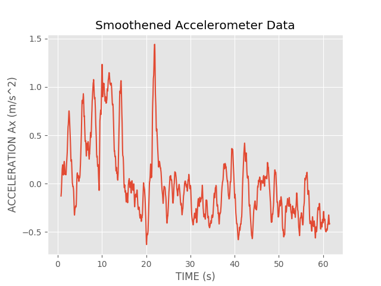
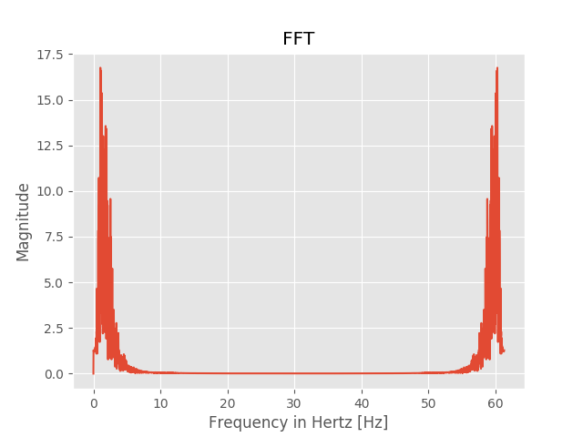
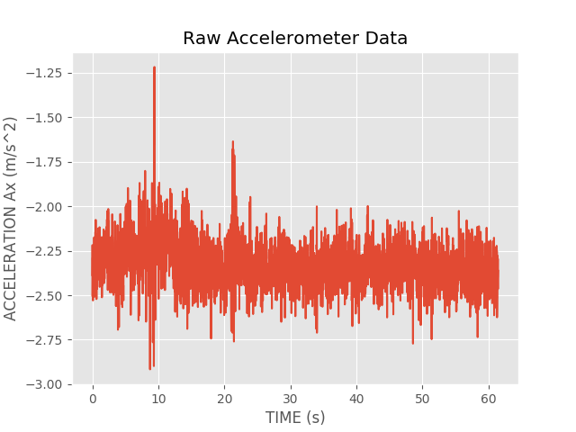
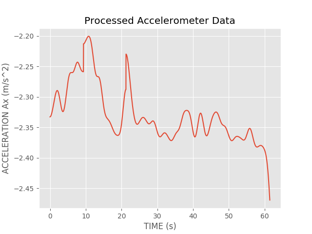
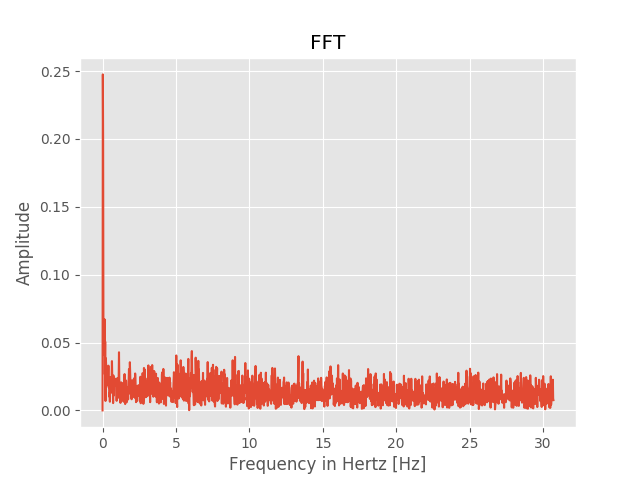
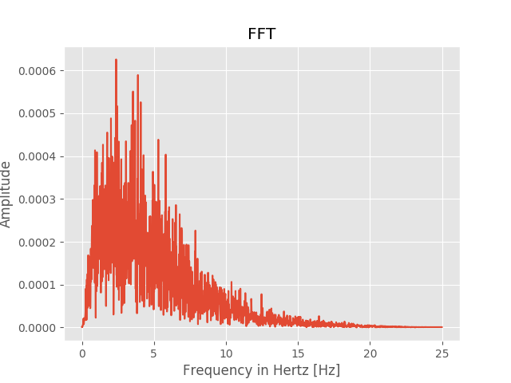
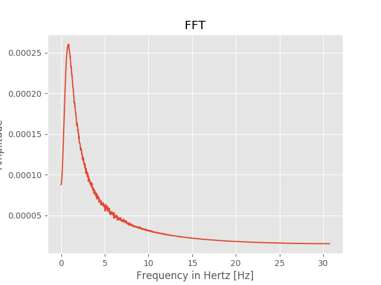

# Smart-Sensing

Analysis of various HR/BR estimation algorithms from accelerometer data. The goal is to extract/summarize the resting-state respiration rate and/or heart rate from wrist-accelerometer data. 

#### Datasets
* [UCI Mhealth Dataset](https://archive.ics.uci.edu/ml/datasets/MHEALTH+Dataset) - Dataset 1
* [Dataset for ADL Recognition with Wrist-worn Accelerometer Data Set](https://archive.ics.uci.edu/ml/datasets/Dataset+for+ADL+Recognition+with+Wrist-worn+Accelerometer) - Dataset 2 and 3

#### Publications
* [Bio Watch](https://ieeexplore.ieee.org/abstract/document/7349394)
* [Sleep Monitor](http://mcn.cse.psu.edu/paper/xiaosun/ubicomp-xiao17.pdf)
* [SeismoTracker](https://dl.acm.org/citation.cfm?id=2892279)

#### Results

Dataset 1: (datasets/uic_dataset.csv)

|               |Heart Rate(bpm)|  Breathing Rate(bpm)|
|---------------|---------------|---------------------|
|Bio Watch|           84.176183      |      17.804154
|SeismoTracker |     114.946272     |       14.327581
|Sleep Monitor|         -|           |15.075377|

Dataset 2: (datasets/hmp_dataset1.csv)

|               |Heart Rate(bpm)|  Breathing Rate(bpm)|
|---------------|---------------|---------------------|
|Bio Watch            |44.835165            |11.034483|
|SeismoTracker        |54.059946            |10.463215|
|Sleep Monitor         |-            |15.118110|

Dataset 3: (datasets/hmp_dataset2.csv)

|               |Heart Rate(bpm)|  Breathing Rate(bpm)|
|---------------|---------------|---------------------|
|Bio Watch      |      45.782414 |            9.014085|
|SeismoTracker  |    100.206795 |           10.398818|
|Sleep Monitor  |      -|          15.118110|

## Bio Watch

Estimation of heart and breathing rates from wrist motions, based on Ballistocardiography.

### System Overview for Heart Rate and Respiratory Rate

1. Accelerometer Data


2. Normalization with z-score

X, Y, Z axes of accelerometer values are normalized with z-scores to give them same relevance. 


3. Estimation of Pulse wave and pulse rate

* Averaging filter for each component to smoothen data


* Band pass butterworth filter of order 2 (4 Hz - 11 Hz)


* Aggregate components
* Band pass butterworth filter of order 2 (0.66 Hz - 2.5 Hz)


* Apply FFT to obtain Heart rate in frequency domain


4. Estimation of Respiratory wave and respiration rate

* Apply averaging filter
* Apply FFT to obtain Respiratory rate in frequency domain on each component and choose one component with most periodic signal. The  periodicity  level  was  defined as the maximum amplitude observed within 0.13 and 0.66 Hz in the frequency domain (corresponding  to 8 and 40 breaths per minute, respectively). 


### Output

```sh
$ python3 bio_watch.py
Max Amplitude: 22.0776535924
Max Frequency: 1.40293637847
Heart Rate (bpm): 84.176182708
Max Amplitude within 0.13 and 0.66 Hz frequency:
X-Axis: 166.010352621
Y-Axis: 99.0713761738
Z-Axis: 93.7763489353
Max amplitude chosen: 166.010352621
Frequency of chosen amplitude: 0.296735905045
Respiratory Rate (bpm): 17.8041543027
```

## Sleep Monitor

### System Overview for Respiratory rate

1. Raw Accelerometer Data



2. Segmentation

3. Processing - Total Variation filter



4. FFT - Respiratory rate estimation on each axis

5. Multi axis fusion - Kalman filter

### Output

```sh
$ python3 sleep_monitor.py
Number of records: 3072
Segmenting data...
Number of segments: 61
Size of each segment: 51
Removing segments with motion...
Number of filtered segments: 61
Number of records: 3072
Denoisifying data...
Converting time domain signal to frequency domain by FFT...
Performing multi-axis fusion by Kalman filter...
Breathing rate from Kalman filter: 15.0753768844
```

## Seismotracker

Based on Seismocardiography(SCG) approach.

### System Overview for Heart Rate and Respiratory Rate

1. Raw Accelerometer Data


2. Preprocessing - Normalize

3. Respiratory Rate estimation
- based on prevalent signal amplitude in frequency domain

X-Axis:


Y-Axis:


Z-Axis:



4. High pass filter


5. Low pass filter


6. Heart Rate Estimation - FFT

X-Axis:


Y-Axis:



Z-Axis:



### Output

```zsh
$ python3 seismotracker.py
Breathing Rate:
X-Axis:
Max Amplitude: 206.352510961
Frequency: 0.293064148486
Respiration Rate (bpm): 17.5838489092
Y-Axis:
Max Amplitude: 130.772935511
Frequency: 0.276782806903
Respiration Rate (bpm): 16.6069684142
Z-Axis:
Max Amplitude: 155.664930948
Frequency: 0.146532074243
Respiration Rate (bpm): 8.79192445458
Average Respiration Rate (bpm): 14.3275805926

Heart Rate:
X-Axis:
Max Amplitude: 1.35768415257
Frequency: 2.45848257896
Heart Rate (bpm): 147.508954738
Y-Axis:
Max Amplitude: 1.92224270757
Frequency: 2.37707587105
Heart Rate (bpm): 142.624552263
Z-Axis:
Max Amplitude: 1.49709366808
Frequency: 0.911755128623
Heart Rate (bpm): 54.7053077174
Average Heart Rate (bpm): 114.946271573

```